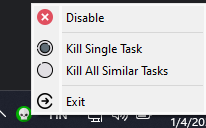

# Superaltf4
___
#### Some games disable alt+f4 and it's very annoying and unpractical. Here's the solution!

This program can close any software even if it tries to disable the alt+f4 key combination.
It basically forces any program to close, but it is not recommended to use this when the game or software is saving.

## How to install
1. Install required modules: "pip install -r requirements.txt"
2. Run main.py

## How to use
To close any program instantly, simply press: ctrl + alt + f4
After starting the program, it creates a system tray icon and when clicked, a menu opens.

- Kill Single Task: Stops the frontmost window
- Kill All Similar Tasks: Stops all tasks with the same name